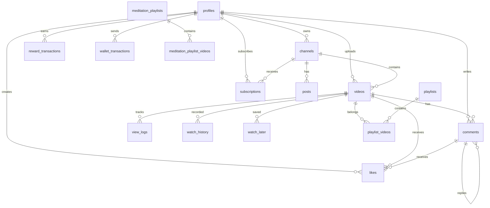

<p align="center">
  
</p>

<h1 align="center">🎬 FUN Play - Web3 Video Platform</h1>

<p align="center">
  <strong>Nền tảng chia sẻ video Web3 với AI Chatbot, Token Rewards và Meditation Mode</strong>
</p>

<p align="center">
  
  
  
  
  
  
  
</p>

---

## 📖 Mục Lục

- [Giới Thiệu](#-giới-thiệu)
- [Tính Năng](#-tính-năng)
- [Tech Stack](#-tech-stack)
- [Yêu Cầu Hệ Thống](#-yêu-cầu-hệ-thống)
- [Cài Đặt](#-cài-đặt)
- [Environment Variables](#-environment-variables)
- [Database Schema](#-database-schema)
- [Edge Functions](#-edge-functions)
- [Cấu Trúc Project](#-cấu-trúc-project)
- [Deployment](#-deployment)
- [Mobile App (Capacitor)](#-mobile-app-capacitor)
- [Web3 Configuration](#-web3-configuration)
- [Contributing](#-contributing)
- [FAQ & Troubleshooting](#-faq--troubleshooting)
- [License](#-license)

---

## 🎯 Giới Thiệu

**FUN Play** là một nền tảng chia sẻ video phi tập trung kết hợp:

- 🎬 **Video Platform** giống YouTube với upload, xem, like, comment
- 💰 **Web3 Wallet** tích hợp ví crypto (MetaMask, WalletConnect) trên BSC
- 🏆 **Token Rewards** - Nhận CAMLY tokens khi xem video, comment, upload
- 🤖 **AI Chatbot Angel** - Trợ lý ảo với giọng nói (ElevenLabs)
- 🧘 **Meditation Mode** - Chế độ thiền với nhạc ambient và timer
- 🎵 **AI Music Generator** - Tạo nhạc bằng AI
- 🖼️ **NFT Gallery** - Hiển thị NFT từ ví
- 📱 **PWA + Native App** - Hỗ trợ cài đặt và Capacitor

---

## ✨ Tính Năng

### 🎬 Video Platform
- Upload video lên Cloudflare R2
- Video player với progress tracking
- Like/Dislike, Comment với replies
- Watch History & Watch Later
- Playlists management
- Channel subscriptions
- Real-time view counts

### 💰 Web3 Integration
- Multi-wallet support (MetaMask, WalletConnect, Coinbase)
- BSC (BNB Smart Chain) network
- Tip creators với BNB hoặc ERC-20 tokens
- Transaction history
- Portfolio tracker

### 🏆 Reward System (CAMLY Token)
| Action | Reward | Daily Limit |
|--------|--------|-------------|
| Xem video ≥80% | 9.999 CAMLY | 500 CAMLY |
| Comment hợp lệ | 5 CAMLY | 250 CAMLY |
| Upload video | 50 CAMLY | 3 videos |
| Like video | 1 CAMLY | 100 CAMLY |

### 🤖 AI Chatbot (Angel Mascot)
- Conversational AI (GPT, Grok, Lovable AI)
- Voice synthesis với ElevenLabs
- Animated mascot với expressions
- Context-aware responses

### 🧘 Meditation Mode
- Curated meditation playlists
- Continuous background music
- Sleep timer (15/30/45/60 min)
- Ambient sounds (rain, forest, ocean)
- Light particles animation

### 🎵 AI Music Generator
- Text-to-music generation
- Multiple genre support
- Duration control
- Download generated tracks

### 🖼️ NFT Gallery
- Display NFTs from connected wallet
- Support multiple chains
- NFT metadata display

---

## 🛠 Tech Stack

### Frontend
| Technology | Version | Purpose |
|------------|---------|---------|
| React | 18.3 | UI Framework |
| TypeScript | 5.0 | Type Safety |
| Vite | 5.0 | Build Tool |
| Tailwind CSS | 3.4 | Styling |
| Shadcn/UI | Latest | Component Library |
| Framer Motion | 12.x | Animations |
| React Router | 6.30 | Routing |
| TanStack Query | 5.x | Data Fetching |

### Web3
| Technology | Version | Purpose |
|------------|---------|---------|
| Wagmi | 3.0 | React Hooks for Ethereum |
| Viem | 2.40 | Ethereum Interface |
| WalletConnect | 2.21 | Multi-wallet Support |
| Ethers.js | 6.15 | Blockchain Interactions |
| Web3Modal | 5.1 | Wallet Connection UI |

### Backend (Lovable Cloud / Supabase)
| Technology | Purpose |
|------------|---------|
| PostgreSQL | Database |
| Deno Edge Functions | Serverless Backend |
| Row Level Security | Data Protection |
| Realtime | Live Updates |
| Storage | File Management |

### External Services
| Service | Purpose |
|---------|---------|
| Cloudflare R2 | Video & Image Storage |
| OpenAI | AI Chat (GPT) |
| xAI | AI Chat (Grok) |
| ElevenLabs | Voice Synthesis |
| Lovable AI | Built-in AI Gateway |

### Mobile
| Technology | Purpose |
|------------|---------|
| Capacitor | Native iOS/Android |
| PWA | Installable Web App |

---

## 📋 Yêu Cầu Hệ Thống

### Development
- **Node.js**: >= 18.0.0
- **npm**: >= 9.0.0
- **Git**: Latest

### Accounts Required
- [Lovable](https://lovable.dev) account (includes Supabase)
- [WalletConnect Cloud](https://cloud.walletconnect.com) - Project ID
- [Cloudflare](https://cloudflare.com) - R2 Storage (optional)
- [OpenAI](https://platform.openai.com) - API Key (optional)
- [ElevenLabs](https://elevenlabs.io) - API Key (optional)

### For Mobile Development
- **iOS**: macOS + Xcode 15+
- **Android**: Android Studio + SDK 34+

---

## 🚀 Cài Đặt

### 1. Clone Repository

```bash
git clone https://github.com/your-username/funlay.git
cd funlay
```

### 2. Install Dependencies

```bash
# IMPORTANT: Use --legacy-peer-deps flag
npm install --legacy-peer-deps
```

> ⚠️ **Note**: Project sử dụng một số dependencies có peer conflicts, flag `--legacy-peer-deps` là bắt buộc.

### 3. Setup Environment Variables

```bash
# Copy example file
cp .env.example .env

# Edit với values của bạn
nano .env
```

### 4. Start Development Server

```bash
npm run dev
```

Mở browser tại: `http://localhost:8080`

### 5. Build for Production

```bash
npm run build
```

Output folder: `dist/`

---

## 🔐 Environment Variables

Tạo file `.env` trong root folder với các biến sau:

### Required Variables

| Variable | Description | Example |
|----------|-------------|---------|
| `VITE_SUPABASE_URL` | Supabase Project URL | `https://xxx.supabase.co` |
| `VITE_SUPABASE_PUBLISHABLE_KEY` | Supabase Anon Key | `eyJhbG...` |
| `VITE_SUPABASE_PROJECT_ID` | Supabase Project ID | `fzgjmvxtgrlwrluxdwjq` |

### Web3 Variables

| Variable | Description | How to Get |
|----------|-------------|------------|
| `VITE_WALLETCONNECT_PROJECT_ID` | WalletConnect Cloud Project ID | [WalletConnect Cloud](https://cloud.walletconnect.com) |

### AI Services (Edge Function Secrets)

| Secret Name | Description | Required |
|-------------|-------------|----------|
| `OPENAI_API_KEY` | OpenAI API Key | Optional |
| `XAI_API_KEY` | xAI Grok API Key | Optional |
| `ELEVENLABS_API_KEY` | ElevenLabs API Key | Optional |
| `LOVABLE_API_KEY` | Lovable AI Gateway | Auto-provided |

### Cloudflare R2 (Edge Function Secrets)

| Secret Name | Description |
|-------------|-------------|
| `R2_ENDPOINT` | R2 S3-compatible endpoint |
| `R2_ACCESS_KEY_ID` | R2 Access Key |
| `R2_SECRET_ACCESS_KEY` | R2 Secret Key |
| `R2_BUCKET_NAME` | R2 Bucket Name |
| `R2_PUBLIC_URL` | Public URL for bucket |

### Blockchain (Edge Function Secrets)

| Secret Name | Description |
|-------------|-------------|
| `CAMLY_ADMIN_WALLET_PRIVATE_KEY` | Admin wallet for token distribution |

---

## 🗄 Database Schema

### Entity Relationship Diagram



### Tables Overview

| Table | Description | RLS |
|-------|-------------|-----|
| `profiles` | User profiles (linked to auth.users) | ✅ |
| `channels` | Creator channels | ✅ |
| `videos` | Video metadata | ✅ |
| `comments` | Video comments | ✅ |
| `likes` | Likes/dislikes for videos & comments | ✅ |
| `subscriptions` | Channel subscriptions | ✅ |
| `view_logs` | Video view tracking | ✅ |
| `watch_history` | User watch history | ✅ |
| `watch_later` | Watch later list | ✅ |
| `playlists` | User playlists | ✅ |
| `playlist_videos` | Videos in playlists | ✅ |
| `meditation_playlists` | Meditation playlists | ✅ |
| `meditation_playlist_videos` | Videos in meditation playlists | ✅ |
| `posts` | Channel posts/updates | ✅ |
| `reward_transactions` | CAMLY reward history | ✅ |
| `reward_settings` | Global reward configuration | ✅ |
| `daily_reward_limits` | Per-user daily limits | ✅ |
| `claim_requests` | Token claim requests | ✅ |
| `wallet_transactions` | Tip/transfer history | ✅ |
| `user_roles` | User roles (admin/moderator/user) | ✅ |
| `platform_statistics` | Platform-wide stats | ✅ |
| `video_watch_progress` | Video progress tracking | ✅ |
| `video_migrations` | Video migration status | ✅ |
| `comment_logs` | Comment tracking for rewards | ✅ |

### Key RLS Policies

```sql
-- Videos: Public readable, owner writable
CREATE POLICY "Public videos are viewable by everyone" 
ON public.videos FOR SELECT 
USING ((is_public = true) OR (auth.uid() = user_id));

CREATE POLICY "Users can create videos on their channel" 
ON public.videos FOR INSERT 
WITH CHECK (auth.uid() = user_id);

-- Profiles: Public readable, owner writable
CREATE POLICY "Profiles are viewable by everyone" 
ON public.profiles FOR SELECT 
USING (true);

CREATE POLICY "Users can update their own profile" 
ON public.profiles FOR UPDATE 
USING (auth.uid() = id);

-- Admin check function
CREATE OR REPLACE FUNCTION public.has_role(_user_id uuid, _role app_role)
RETURNS boolean AS $$
  SELECT EXISTS (
    SELECT 1 FROM public.user_roles
    WHERE user_id = _user_id AND role = _role
  )
$$ LANGUAGE sql STABLE SECURITY DEFINER;
```

---

## ⚡ Edge Functions

### Available Functions

| Function | Path | Auth | Description |
|----------|------|------|-------------|
| `ai-chat` | `/functions/v1/ai-chat` | Optional | General AI chatbot |
| `angel-chat` | `/functions/v1/angel-chat` | Optional | Angel mascot AI |
| `angel-voice` | `/functions/v1/angel-voice` | Optional | OpenAI TTS voice |
| `angel-voice-elevenlabs` | `/functions/v1/angel-voice-elevenlabs` | Optional | ElevenLabs voice |
| `award-camly` | `/functions/v1/award-camly` | Required | Award CAMLY tokens |
| `claim-camly` | `/functions/v1/claim-camly` | Required | Claim accumulated rewards |
| `generate-music` | `/functions/v1/generate-music` | Optional | AI music generation |
| `r2-upload` | `/functions/v1/r2-upload` | Required | Upload to Cloudflare R2 |
| `migrate-to-r2` | `/functions/v1/migrate-to-r2` | Admin | Migrate videos to R2 |

### Example: Calling Edge Function

```typescript
import { supabase } from "@/integrations/supabase/client";

// Using supabase client
const { data, error } = await supabase.functions.invoke('ai-chat', {
  body: { messages: [{ role: 'user', content: 'Hello!' }] }
});

// Using fetch (for binary responses like audio)
const response = await fetch(
  `${import.meta.env.VITE_SUPABASE_URL}/functions/v1/angel-voice-elevenlabs`,
  {
    method: 'POST',
    headers: {
      'Content-Type': 'application/json',
      'apikey': import.meta.env.VITE_SUPABASE_PUBLISHABLE_KEY,
      'Authorization': `Bearer ${import.meta.env.VITE_SUPABASE_PUBLISHABLE_KEY}`,
    },
    body: JSON.stringify({ text: 'Hello!' }),
  }
);
const audioBlob = await response.blob();
```

---

## 📁 Cấu Trúc Project

```
funlay/
├── public/                    # Static assets
│   ├── images/               # Public images
│   ├── videos/               # Public videos
│   ├── sw.js                 # Service Worker
│   └── robots.txt            # SEO
│
├── src/
│   ├── assets/               # Imported assets
│   │
│   ├── components/           # React Components
│   │   ├── AI/               # AI Chatbot
│   │   │   ├── AIChatbot.tsx
│   │   │   └── AIVideoGenerator.tsx
│   │   │
│   │   ├── Layout/           # Layout components
│   │   │   ├── Header.tsx
│   │   │   ├── Sidebar.tsx
│   │   │   ├── Honobar.tsx
│   │   │   └── CategoryChips.tsx
│   │   │
│   │   ├── Mascot/           # Angel Mascot
│   │   │   ├── AngelMascot.tsx
│   │   │   └── AngelChat.tsx
│   │   │
│   │   ├── Meditation/       # Meditation Mode
│   │   │   ├── MeditationPlayer.tsx
│   │   │   ├── MeditationPlaylists.tsx
│   │   │   └── AmbientSoundSelector.tsx
│   │   │
│   │   ├── Video/            # Video components
│   │   │   ├── VideoCard.tsx
│   │   │   ├── EnhancedVideoPlayer.tsx
│   │   │   ├── UploadVideoModal.tsx
│   │   │   └── ShareModal.tsx
│   │   │
│   │   ├── Web3/             # Web3 components
│   │   │   ├── WalletButton.tsx
│   │   │   ├── MultiTokenWallet.tsx
│   │   │   ├── TokenSwap.tsx
│   │   │   └── PortfolioTracker.tsx
│   │   │
│   │   ├── Tipping/          # Tipping system
│   │   │   └── TipModal.tsx
│   │   │
│   │   ├── Rewards/          # Rewards UI
│   │   │   ├── ClaimRewardsButton.tsx
│   │   │   ├── ClaimRewardsModal.tsx
│   │   │   └── RewardNotification.tsx
│   │   │
│   │   ├── Profile/          # Profile components
│   │   │   ├── AchievementBadges.tsx
│   │   │   ├── RewardStats.tsx
│   │   │   └── ProfileCompletionIndicator.tsx
│   │   │
│   │   ├── Studio/           # Creator Studio
│   │   │   ├── StudioContent.tsx
│   │   │   ├── StudioPlaylists.tsx
│   │   │   └── StudioSettings.tsx
│   │   │
│   │   └── ui/               # Shadcn UI components
│   │
│   ├── contexts/             # React Contexts
│   │   ├── MusicPlayerContext.tsx
│   │   └── VideoPlaybackContext.tsx
│   │
│   ├── hooks/                # Custom Hooks
│   │   ├── useAuth.tsx
│   │   ├── useProfile.tsx
│   │   ├── useWalletConnection.ts
│   │   ├── useR2Upload.ts
│   │   ├── useWatchHistory.ts
│   │   ├── useWatchLater.ts
│   │   ├── useCryptoPrices.tsx
│   │   └── useRewardStatistics.tsx
│   │
│   ├── lib/                  # Utilities
│   │   ├── utils.ts
│   │   ├── web3Config.ts
│   │   ├── tipping.ts
│   │   ├── enhancedRewards.ts
│   │   └── pushNotifications.ts
│   │
│   ├── config/               # Configuration
│   │   └── tokens.ts         # Supported tokens
│   │
│   ├── pages/                # Route Pages
│   │   ├── Index.tsx         # Homepage
│   │   ├── Watch.tsx         # Video watch page
│   │   ├── Upload.tsx        # Upload page
│   │   ├── Channel.tsx       # Channel page
│   │   ├── Studio.tsx        # Creator Studio
│   │   ├── Meditate.tsx      # Meditation mode
│   │   ├── CreateMusic.tsx   # AI Music Generator
│   │   ├── NFTGallery.tsx    # NFT Gallery
│   │   ├── Wallet.tsx        # Wallet page
│   │   ├── Auth.tsx          # Login/Signup
│   │   ├── ProfileSettings.tsx
│   │   ├── Leaderboard.tsx
│   │   ├── AdminDashboard.tsx
│   │   └── ...
│   │
│   ├── integrations/         # External integrations
│   │   └── supabase/
│   │       ├── client.ts     # Supabase client (auto-generated)
│   │       └── types.ts      # Database types (auto-generated)
│   │
│   ├── App.tsx               # Main App component
│   ├── App.css               # Global styles
│   ├── index.css             # Tailwind base + design tokens
│   └── main.tsx              # Entry point
│
├── supabase/
│   ├── functions/            # Edge Functions
│   │   ├── ai-chat/
│   │   ├── angel-chat/
│   │   ├── angel-voice/
│   │   ├── angel-voice-elevenlabs/
│   │   ├── award-camly/
│   │   ├── claim-camly/
│   │   ├── generate-music/
│   │   ├── r2-upload/
│   │   └── migrate-to-r2/
│   │
│   ├── migrations/           # Database migrations (auto-generated)
│   └── config.toml           # Supabase configuration
│
├── capacitor.config.ts       # Capacitor config
├── tailwind.config.ts        # Tailwind configuration
├── vite.config.ts            # Vite configuration
├── tsconfig.json             # TypeScript configuration
├── package.json
├── .env.example              # Environment template
└── README.md                 # This file
```

---

## 🚀 Deployment

### Option 1: Lovable (Recommended)

1. Open your project in Lovable
2. Click **"Publish"** button (top right)
3. Choose domain settings
4. Click **"Update"** to deploy

> Frontend changes require clicking "Update". Backend (Edge Functions, Database) deploy automatically.

### Option 2: Cloudflare Pages

1. Connect GitHub repository to Cloudflare Pages
2. Configure build settings:

| Setting | Value |
|---------|-------|
| Build command | `npm run build` |
| Output directory | `dist` |
| Node.js version | `18` |
| Environment variable | `NPM_FLAGS=--legacy-peer-deps` |

3. Add environment variables in Cloudflare dashboard
4. Deploy!

### Option 3: Vercel

```bash
# Install Vercel CLI
npm i -g vercel

# Deploy
vercel --prod
```

Configure in `vercel.json`:
```json
{
  "buildCommand": "npm run build",
  "outputDirectory": "dist",
  "installCommand": "npm install --legacy-peer-deps"
}
```

### Option 4: Netlify

```bash
# Install Netlify CLI
npm i -g netlify-cli

# Deploy
netlify deploy --prod
```

Configure in `netlify.toml`:
```toml
[build]
  command = "npm run build"
  publish = "dist"

[build.environment]
  NPM_FLAGS = "--legacy-peer-deps"
  NODE_VERSION = "18"
```

---

## 📱 Mobile App (Capacitor)

### Prerequisites

- **iOS**: macOS with Xcode 15+
- **Android**: Android Studio with SDK 34+

### Setup

```bash
# Install Capacitor CLI (if not installed)
npm install @capacitor/cli --save-dev

# Add platforms
npx cap add ios
npx cap add android
```

### Development Workflow

```bash
# 1. Build web app
npm run build

# 2. Sync to native platforms
npx cap sync

# 3. Open in IDE
npx cap open ios     # Opens Xcode
npx cap open android # Opens Android Studio

# 4. Run on device/emulator
npx cap run ios
npx cap run android
```

### Hot Reload (Development)

The `capacitor.config.ts` is configured for hot reload:

```typescript
const config: CapacitorConfig = {
  appId: 'app.lovable.53abc96fe8d144f6a34977f6b110041f',
  appName: 'funlay',
  server: {
    url: 'https://your-project.lovableproject.com?forceHideBadge=true',
    cleartext: true
  }
};
```

> ⚠️ Remove `server.url` for production builds!

### Build for Production

```bash
# iOS
npx cap sync ios
# Open Xcode -> Product -> Archive

# Android
npx cap sync android
# Open Android Studio -> Build -> Generate Signed Bundle
```

---

## 🔗 Web3 Configuration

### WalletConnect Setup

1. Go to [WalletConnect Cloud](https://cloud.walletconnect.com)
2. Create a new project
3. Copy the **Project ID**
4. Add to secrets: `VITE_WALLETCONNECT_PROJECT_ID`

### Supported Networks

Currently configured for **BNB Smart Chain (BSC)**:

```typescript
// src/lib/web3Config.ts
const bsc = {
  id: 56,
  name: 'BNB Smart Chain',
  nativeCurrency: { name: 'BNB', symbol: 'BNB', decimals: 18 },
  rpcUrls: {
    default: { http: ['https://bsc-dataseed.binance.org/'] },
  },
  blockExplorers: {
    default: { name: 'BscScan', url: 'https://bscscan.com' },
  },
};
```

### Supported Tokens

Configured in `src/config/tokens.ts`:

| Token | Symbol | Contract |
|-------|--------|----------|
| BNB | BNB | Native |
| USDT | USDT | `0x55d398326f99059fF775485246999027B3197955` |
| USDC | USDC | `0x8AC76a51cc950d9822D68b83fE1Ad97B32Cd580d` |
| BUSD | BUSD | `0xe9e7CEA3DedcA5984780Bafc599bD69ADd087D56` |
| CAMLY | CAMLY | Custom Token |

### Adding Custom Token

```typescript
// src/config/tokens.ts
export const SUPPORTED_TOKENS = [
  // ... existing tokens
  {
    symbol: 'YOUR_TOKEN',
    name: 'Your Token Name',
    address: '0x...contract_address',
    decimals: 18,
    icon: '🪙'
  }
];
```

---

## 🤝 Contributing

### Getting Started

1. Fork the repository
2. Create a feature branch: `git checkout -b feature/amazing-feature`
3. Commit changes: `git commit -m 'Add amazing feature'`
4. Push to branch: `git push origin feature/amazing-feature`
5. Open a Pull Request

### Code Style

- Use TypeScript for all new files
- Follow existing component patterns
- Use Tailwind CSS semantic tokens (no hardcoded colors)
- Add proper TypeScript types
- Write meaningful commit messages

### Pull Request Checklist

- [ ] Code follows project style
- [ ] Added TypeScript types
- [ ] No hardcoded colors (use design tokens)
- [ ] Tested on mobile viewport
- [ ] No console errors/warnings
- [ ] Updated README if needed

---

## ❓ FAQ & Troubleshooting

### Build Errors

**Q: npm install fails with peer dependency errors**
```bash
# Solution: Use legacy-peer-deps flag
npm install --legacy-peer-deps
```

**Q: TypeScript errors after database changes**
```bash
# Types are auto-generated, just wait for rebuild
# Or manually refresh the Lovable preview
```

### Runtime Errors

**Q: "Failed to fetch" when calling Edge Functions**
- Check if the function is deployed
- Verify CORS headers are set
- Check Supabase logs for errors

**Q: Wallet connection fails**
- Verify `VITE_WALLETCONNECT_PROJECT_ID` is set
- Check browser console for errors
- Try clearing browser cache

**Q: Videos not uploading**
- Check R2 credentials in Supabase secrets
- Verify bucket exists and is public
- Check file size limits

### Database Issues

**Q: RLS policy blocking queries**
- Ensure user is authenticated
- Check if `user_id` is being set correctly
- Verify policy conditions in Supabase dashboard

**Q: Missing data in queries**
- Supabase has 1000 row default limit
- Add `.range()` or pagination for large datasets

### Mobile Issues

**Q: Capacitor build fails**
```bash
# Clean and rebuild
rm -rf node_modules ios android
npm install --legacy-peer-deps
npx cap add ios
npx cap add android
npm run build
npx cap sync
```

---

## 📄 License

This project is licensed under the **MIT License** - see the [LICENSE](LICENSE) file for details.

---

## 🙏 Credits

### Technologies
- [React](https://react.dev) - UI Framework
- [Vite](https://vitejs.dev) - Build Tool
- [Tailwind CSS](https://tailwindcss.com) - Styling
- [Shadcn/UI](https://ui.shadcn.com) - Component Library
- [Supabase](https://supabase.com) - Backend
- [Wagmi](https://wagmi.sh) - Web3 Hooks
- [Framer Motion](https://www.framer.com/motion/) - Animations
- [Capacitor](https://capacitorjs.com) - Native Apps

### Services
- [Lovable](https://lovable.dev) - Development Platform
- [Cloudflare R2](https://www.cloudflare.com/products/r2/) - Storage
- [WalletConnect](https://walletconnect.com) - Wallet Connection
- [OpenAI](https://openai.com) - AI Chat
- [ElevenLabs](https://elevenlabs.io) - Voice Synthesis

---

<p align="center">
  Made with ❤️ by the FUN Play Team
</p>

<p align="center">
  <a href="https://lovable.dev">
    
  </a>
</p>
